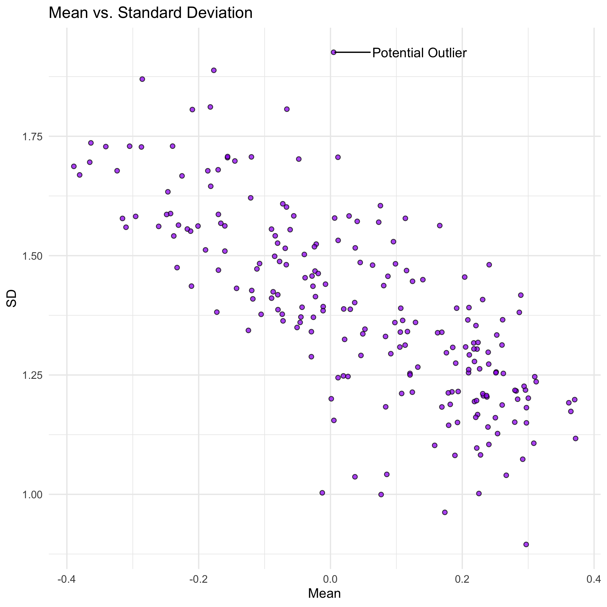
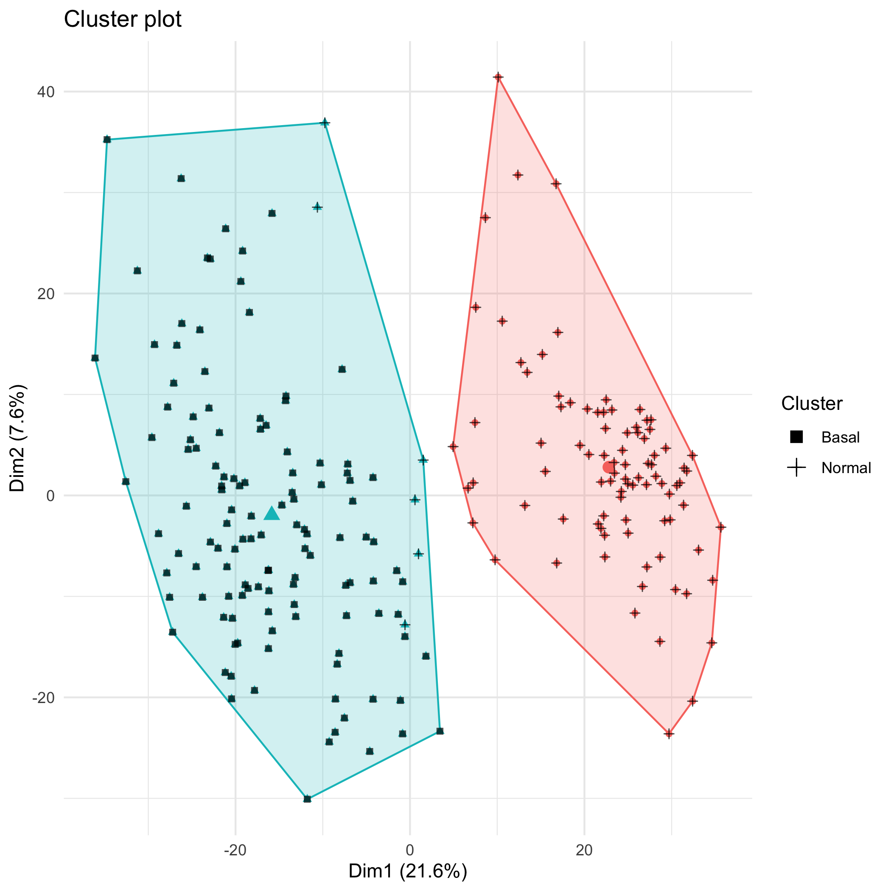

TCGA Gene Expression Project
----------------------------
#### Authors:
Henry Cervantes \
Puyao Ge \
Matt Johnson

***

### USAGE

You'll need Docker and the ability to run Docker as your current user.

You'll need to build the container:

    > docker build . -t tcga_env

This Docker container is based on rocker/verse. To run rstudio server:

    > docker run -v `pwd`:/home/rstudio -p 8787:8787 -e PASSWORD=mypass -t tcga-env
      
Then connect to the machine on port 8787.

#### Data
Data will need to be in current directory named `TCGA_sample.txt` as a text file. 

#### Make
Use Makefile as recipe book for building artifacts found in derived directories. 

##### Example:
In local project directory, to build artifact `Example.csv`:

    > make derived_data/Example.csv
    
Use artifacts before colon as make targets. Dependencies are listed after colon.

***

Abstract
--------
Tumor classification and detection are integral tasks for determining if an individual has certain cancers and are prominent areas of study in biology and biostatistics. The Cancer Genome Atlas (TCGA) has characterized thousands of cancerous cells in an attempt to better diagnose, treat, and prevent cancer. We attempt to cluster and classify 217 Basal and Normal tumors using machine learning algorithms. We performed Principal Component Analysis (PCA) on the unlabeled centered observations of 2000 genes for each tumor as dimensionality reduction finding 80% cumulative variance explained with only 58 principal components. A K-Means clustering algorithm and an agglomerative clustering algorithm are then fitted on the centered data to find structure in the unlabeled feature vectors of the tumors. Finally, a K-Nearest-Neighbor (KNN) classification algorithm is trained on unlabeled tumors using cross-validation. The K-Means and agglomerative clustering analyses resulted in two nearly homogeneous clusters of Normal and Basal tumors that would be useful in finding structure of future unlabeled tumors. Similarly, the KNN classification algorithm had an accuracy of 93% on out of sample test data. We conclude that Basal and Normal tumors are genetically different and distinguishable based on our small sample.

***

Introduction
------------
The Cancer Genome Atlas (TCGA) is a landmark cancer genomics program launched by the National Cancer Institute and the National Human Genome Research Institute in 2006. This program molecularly characterized over 20,000 primary cancer and matched normal samples spanning 33 cancer types. Over the years, TCGA generated over 2.5 petabytes of data which has already led to improvements in our ability to diagnose, treat, and prevent cancer. In our project, we are going to explore an anonymized dataset of gene expression values from 2000 genes measured for 217 breast cancer tumors. Each tumor has been labeled according to its subtype: Normal or Basal. Breast cancer is the most frequently diagnosed cancer and the second cause of cancer deaths in women, so it is important and valuable to use data analysis techniques in dealing with this dataset and try to find the relationship of gene expressions and tumor subtypes.

In this project, we will follow a regular process in the field of Statistics. We start with the exploratory data analysis (EDA), which is an approach to analyzing data sets to summarize their main characteristics. Then we will implement two particular types of unsupervised learning: principal components analysis and clustering. Principal components analysis (PCA) is a popular approach for deriving a low-dimensional set of features from a large set of variables. Clustering is a broad class of methods for discovering unknown subgroups in data. Finally, we will consider the problem of classification, which is an instance of supervised learning. We will construct a classification model in predicting classes of tumors given observations of their gene expressions.


#### TCGA Gene Expression Data

An anonymized dataset of gene expression values from 2000 genes measured for 217 breast cancer tumors. Each tumor has been labeled according to its subtype: *Normal* or *Basal*. More information as well as the data can be found [here](https://www.cancer.gov/about-nci/organization/ccg/research/structural-genomics/tcga). 

***

Useful Plots
------------

Plot above is the columns means against column Standard Deviation. As you can see there is potentially one outlier. 


Plot above is the result of the K-Means clustering algorithm with 2 centers. 

```{r}
readRDS("README_graphics/Confusion.Table.rds")
```
Table above is the resulting confusion matrix from the KNN classification algorithm on a cross-validated test set. 

Conclusion
----------
In conclusion, we found that we can reliably classify Normal and Basal tumors based on gene expression. The KNN classification algorithm had an accuracy of 93% on cross-validated data. Similarly, the K-Means clustering algorithm correctly grouped 97% of the unlabeled tumors with tumors that were the same subtype. Surprisingly, only the first two principal components were needed to visualize this result. This is most likely due to existing correlations between the expression of specific genes, making it possible to reduce the dimensionality of the data to such a large degree. 

Our model was slightly better at predicting Normal tumors than Basal tumors for this sample dataset. It could be instructive to see if this holds for datasets with more observations and if so, what genomic feature of the Normal tumors lead the algorithm to classify them as Basal. Future research should include a much larger group of tumors and other more advanced clustering and classification algorithms such as Partitioning Around Medoids (PAM) and logistic regression to further test the validity of these preliminary results. 